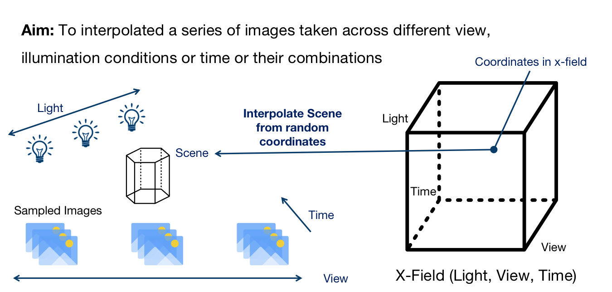

# Xfield-Pytorch

## Introduction

This is a project for Advancement in Computer Graphics Course Assignment 2021 of ZJU

We rewrote the origin x-field implementation into pytorch

Here is the origin work https://xfields.mpi-inf.mpg.de/

And here is the origin repo https://github.com/m-bemana/xfields



> Note that the `flow_vis.py` comes from the origin repo


## Quick Start

Note : We use python 3.6

### 1 UI Interface to See Results

```
pip install -r requirements.txt
```

​	Then You Can Exec new_ui.py to Run a UI interface created by Us.

​    Note: Before that,you should download the 'data' directory from following address,and  put it in the root directory, or the program will not run as expected .

```
link：https://pan.baidu.com/s/1UGiHJjpR-Mimd6HOTa039Q 
Extraction code：saf5  
```

​	We have trained some results for you in the data directory.

### 2 Train and Test by yourself

​	Train:

​		run `python xfield_train.py` for training.

​		Note to Modify the args in the file

​	Test:

​		run `python Gen_video.py` for generating result videos

​   Note to Modify the args in the file, It needs to match the args in the training phase.

​	  Also, you can run `python xfield_test.py` to generate a single picture with a brand new coodinate


Authors: 

​   LuniumLuk ，Fantast416


Project is currently under developement
